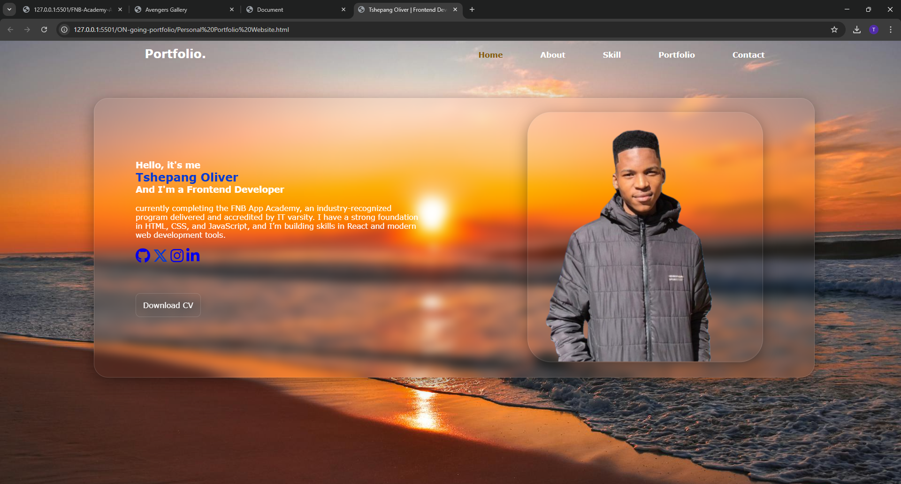
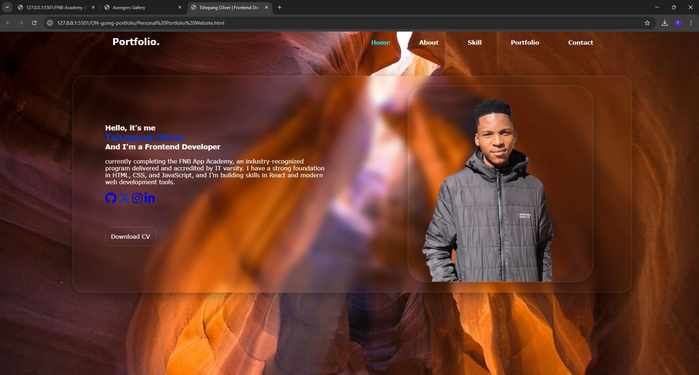
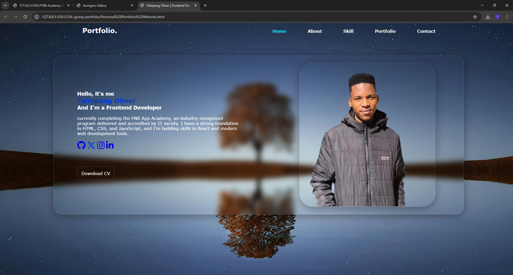
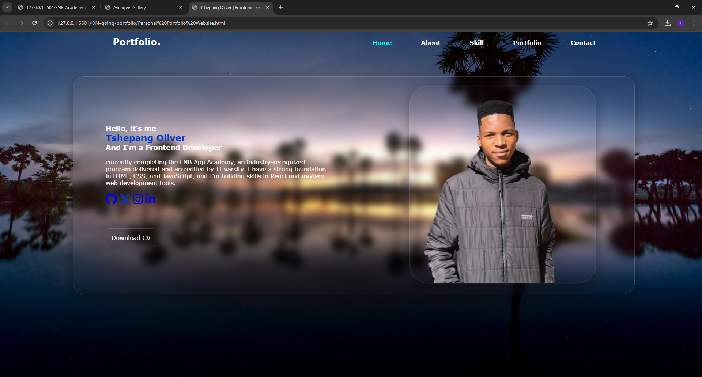

# Tshepang Oliver – Software Developer Portfolio

This is my personal developer portfolio built using **HTML**, **CSS**, and **JavaScript**. It showcases my skills, projects, and growth as a **Software Developer student at IT Varsity**.

The portfolio highlights real-world projects involving web development, backend systems, and basic AI/IoT integrations.

---

##  About Me

Hi, I’m **Tshepang Oliver**, an aspiring Software Developer from South Africa.

I am currently studying at **IT Varsity**, where I am building practical skills in software development through hands-on projects and real-world problem solving.

I focus on:

- Web development using HTML, CSS, and JavaScript  
- Python programming for backend development  
- Building real-world applications and systems  
- Learning modern software development practices  

I enjoy creating clean, responsive, and functional applications that solve real problems and demonstrate continuous learning.

---

##  Project Features

- Responsive multi-page portfolio website  
- Project showcase with live demos and GitHub links  
- Contact form with email integration  
- Clean UI with modern glassmorphism design  
- Mobile-friendly responsive layout  

---

##  Technologies Used

- HTML5  
- CSS3  
- JavaScript  
- Font Awesome (icons)  

---

##  Preview

  
  
  
  

---

